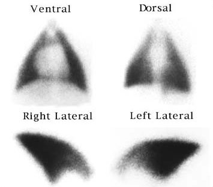
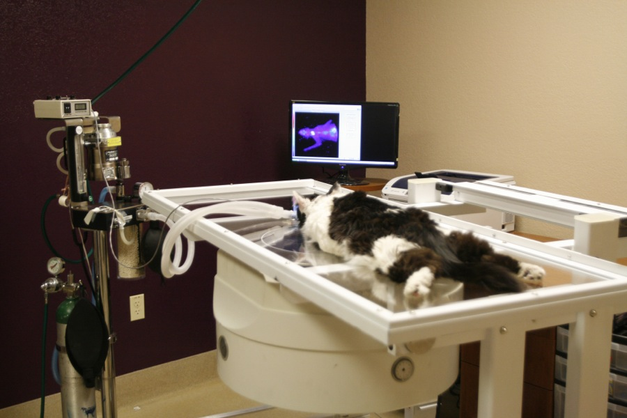
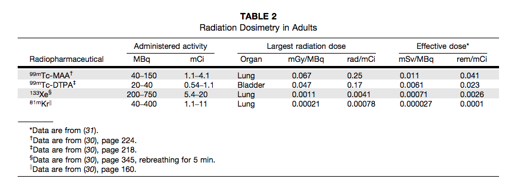

&nbsp;&nbsp;
  
# VQ Protocol Review

David Karimeddini, MD

August 22, 2013

## What scan is this?

Canine VQ scan. **Woof!**

  

## SNM Practice Guidelines 4.0

* version 1.0 - 1996
* version 2.0 - 1999
* version 3.0 - 2004
* version 4.0 - 2011

## Background of the Guidelines
  
<ul>
  <li class="fragment">
    Help advance the science of nuclear medicine
  </li>
  <li class="fragment">
    Improve the quality of service to patients
  </li>
  <li class="fragment">
    Reviewed/renewed every 5 years (or sooner)
  </li>
  <li class="fragment">
    Educational tool
  </li>
  <li class="fragment">
    Not inflexible rules/requirements of practice
  </li>
  <li class="fragment">
    Not intended to establish a legal **standard of care**
  </li>
    
  <li class="fragment">
    Practice of medicine involves **"art"**, not only **science**.  
  </li>
</ul>

## Background of the Guidelines
  
Safe and effective care:  
"Reasonable course of action based on..."
<ol>
  <li class="fragment">
    Knowledge
  </li>
  <li class="fragment">
    Available Resources
  </li>
  <li class="fragment">
    Needs of the Patient
  </li>
</ol>
 

## Purpose of the Guidelines

Assist practitioners in:
<ol>
  <li class="fragment">
    Recommending
  </li>
  <li class="fragment">
    Performing
  </li>
  <li class="fragment">
    Interpreting
  </li>
  <li class="fragment">
    Reporting
  </li>
</ol>

## Common Clinical Indications

1. Acute pulmonary embolism likelihood
1. Chronic PE / resolution of acute PE
1. Quantify pulmonary function
1. Congenital heart / lung disease (shunts, stenoses, fistulae)
1. Bronchopleural fistula
1. Cystic fibrosis
1. Pulmonary hypertension

## Pertinent Clinical History

* Pregnant / Nursing
* Pretest probability (Wells score)
* D-dimer
* History of DVT / PE
* Prior imaging (CXR, V/Q scan)
* Anticoagulation / Thrombolytics
* Deep vein ultrasonography

## Prerequisites 
(preferably)

* PA / Lateral CXR **(recent)**
* CT chest can substitute

<!--Display items sequentially

<section>
  
grow

  
shrink

  
roll-in

  
fade-out

  
highlight-red

  
highlight-green

  
highlight-blue

  </section>-->

## Radiopharmaceuticals

### Ventilation

* Tc-99m-DTPA aerosol
* Tc-99m-sulfur colloid aerosol
* Tc-99m-carbon suspension (Technegas)
* Kr-81m
* Xe-133

### Ventilation

* Tc-99m-DTPA aerosol / sulfur colloid aerosol
  * DTPA most commonly used
  * 25-35 mCi in nebulizer
  * 0.5-1.0 mCi inhaled
  * Linear clearance within few hours
* Tc-99m-carbon suspension (Technegas)
  * Not approved for use in USA
  * Preferable agent, especially in COPD

### Ventilation

* Kr-81m continuous inhalation
  * Not available in the USA
* Xe-133
  * 5-20 mCi
  * Appropriate exhaust in room
  * Posterior images only (sometimes obliques)

## Radiopharmaceuticals

### Perfusion

### Tc-99m-MAA

* Instruct patient to cough / take several deep breaths
* Inject while supine (reduce physiologic perfusion gradient)
* As close to supine as reasonable in orthopneic patients

### Tc-99m-MAA

* Biologic half life: 1.5-3 hours
* 1-4 mCi in adults
* 200-700 K particles
* Reduced particles for
  * Children
  * Pulm HTN
  * R &rarr; L shunt
* 90% must be 10-50 microns
* 90% must be tagged to MAA
* Agitate vial prior to injection (settling)

## Protocol &mdash; Sequence of Imaging

 
<ul style="list-style-type:none;font-size:2em">
  <li class="fragment roll-in">
    V &rarr; Q
  </li>
     
  <li class="fragment roll-in">
    Q &rarr; (V)
  </li>
</ul>

## Protocol &mdash; Sequence of Imaging

### Radioactive gases

* Xe-133 usually performed **before** perfusion
* If perfusion is performed first, ventilation may be omitted
  * if normal
  * if perfusion matches CXR
* If perfusion is **abnormal**, Tc-99m will downscatter during Xe-133 ventilation

* Kr-81m (high energy 190 keV) can be alternated with perfusion images

## Protocol &mdash; Sequence of Imaging

### Aerosols

* Ventilation usually performed first
* At least 4:1 ratio of perfusion to ventilation for adequate interpretation

## Protocol &mdash; Tc-99m-DTPA

* Multiple projections may be obtained
* SPECT can be performed
* Deposition is nonuniform with **turbulent** flow
* **Central** deposition may limit interpretation

## Protocol &mdash; Xe-133

* Single-breath &#x2192; equilibrium &#x2192; washout (sensitive for COPD)
* Usually posterior projection, but if **after** perfusion, can obtain alternate projection which best demonstrated the perfusion defect
* When possible, posterior obliques can be obtained during washout

## Protocol &mdash; Kr-81m

* Images can be obtained in all views without interference from perfusion images (190 keV)
* Short half-life of parent (Rb-81) increases cost / decreases availability
* Imaging can **alternate** with perfusion / no patient repositioning

## Protocol &mdash; Tc-99m-MAA

* Instruct patient to cough, take several deep breaths
* Inject slowly during 3-5 respiratory cycles
* While patient is **supine**
* Image **upright**
  * Increase chest cavity size
  * Minimize diaphragmatic motion

## Protocol &mdash; Tc-99m-MAA

* Projections
  * Ant, Post 
  * RLat, LLat
  * LPO, LAO, RPO, RAO
  * May omit AOs or Lats
* Images of brain
  * Distinguish R &#x2192; L shunt from free Tc-99m

## Protocol &mdash; SPECT/CT

SPECT/low-dose CT

Requires:

* Tc-99m Technegas
* Tc-99m-DTPA
* Kr-81m

Provides anatomic information  
and attenuation correction

## SPECT

## SPECT

* Literature on SPECT is available
* SPECT/low-dose CT literature is emerging
* These methods have not been compared with planar imaging
<li class="fragment">
  Questions:
</li>
<ul>
  <li class="fragment">Optimal CT dose</li>
  <li class="fragment">Gating</li>
  <li class="fragment">Breathing maneuvers</li>
  <li class="fragment">Ventilation images?</li>
</ul>

## Sources of Error

<ul>
  <li class="fragment">
    Hot spots on perfusion &#x2190; clotting in syringe
  </li>
  <li class="fragment">
    Ventilation and Perfusion obtained at different time points and different positions
  </li>
  <li class="fragment">
    Inadequate mixing &#x2190; injecting central line 
  </li>
  <li class="fragment">
    Nonstandard patient positioning
  </li>
  <li class="fragment">
    Thyroid uptake 
    <ul>
      <li class="fragment">Free pertechnetate</li>
      <li class="fragment">Shunting</li>
    </ul>
  </li>
  <li class="fragment">
    Cardiac/Pulmonary Considerations
    <ul> 
      <li class="fragment">Bronchodilators for COPD</li>
      <li class="fragment">CHF &#x2192; delay imaging until treatment instituted</li>
    </ul>
  </li>
</ul>

## Radiation Safety

## References

* Parker JA, Coleman RE, et al. SNM Practice Guideline for Lung Scintigraphy 4.0. JNMT. 2012;40:57-65.
* Gregory, M. Yale-New Haven Hospital Protocols.
