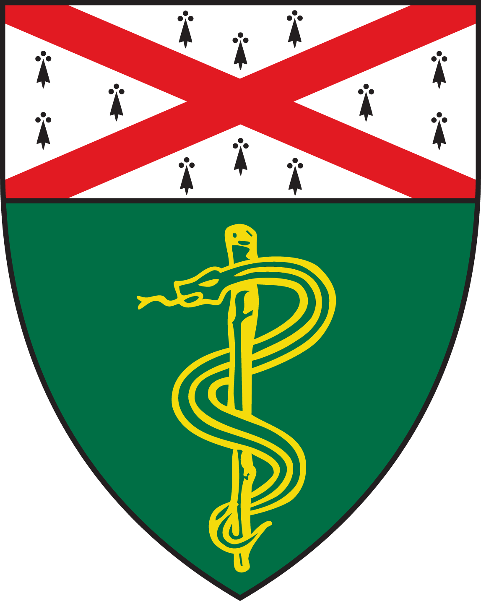

&nbsp;&nbsp;
  
# VQ Protocol Review

David Karimeddini, MD

August 22, 2013

  

## SNM Practice Guidelines 4.0

* version 1.0 - 1996
* version 2.0 - 1999
* version 3.0 - 2004
* version 4.0 - 2011

## Background of the Guidelines
  
<ul>
  <li class="fragment">
    Help advance the science of nuclear medicine
  </li>
  <li class="fragment">
    Improve the quality of service to patients
  </li>
  <li class="fragment">
    Reviewed/renewed every 5 years (or sooner)
  </li>
  <li class="fragment">
    Educational tool
  </li>
  <li class="fragment">
    Not inflexible rules/requirements of practice
  </li>
  <li class="fragment">
    Not intended to establish a legal **standard of care**
  </li>
    
  <li class="fragment">
    Practice of medicine involves **"art"**, not only **science**.  
  </li>
</ul>

## Background of the Guidelines
  
Safe and effective care:  
"Reasonable course of action based on..."
<ol>
  <li class="fragment">
    Knowledge
  </li>
  <li class="fragment">
    Available Resources
  </li>
  <li class="fragment">
    Needs of the Patient
  </li>
</ol>
 

## Purpose of the Guidelines

Assist practitioners in:
<ol>
  <li class="fragment">
    Recommending
  </li>
  <li class="fragment">
    Performing
  </li>
  <li class="fragment">
    Interpreting
  </li>
  <li class="fragment">
    Reporting
  </li>
</ol>

## Common Clinical Indications

1. Acute pulmonary embolism likelihood
1. Chronic PE / resolution of acute PE
1. Quantify pulmonary function
1. Congenital heart / lung disease (shunts, stenoses, fistulae)
1. Bronchopleural fistula
1. Cystic fibrosis
1. Pulmonary hypertension

## Pertinent Clinical History

* Pregnant / Nursing
* Pretest probability (Wells score)
* D-dimer
* History of DVT / PE
* Prior imaging (CXR, V/Q scan)
* Anticoagulation / Thrombolytics
* Deep vein ultrasonography

## Prerequisites (preferably)

* PA / Lateral CXR (recent)
* CT chest can substitute

## Radiopharmaceuticals

### Ventilation

* Tc-99m-DTPA aerosol
* Tc-99m-sulfur colloid aerosol
* Tc-99m-carbon suspension (Technegas)
* Kr-81m
* Xe-133

### Ventilation

* Tc-99m-DTPA aerosol / sulfur colloid aerosol
  * DTPA most commonly used
  * 25-35 mCi in nebulizer
  * 0.5-1.0 mCi inhaled
* Tc-99m-carbon suspension (Technegas)
  * Not approved for use in USA
  * Preferable agent, expecially in COPD

### Ventilation

* Kr-81m continuous inhalation
  * Not available in the USA
* Xe-133
  * 5-20 mCi
  * Appropriate exhaust in room
  * Posterior images only (sometimes obliques)

## Radiopharmaceuticals

### Perfusion

* Tc-99m-MAA

## References

[Return to beginning](#/1)
